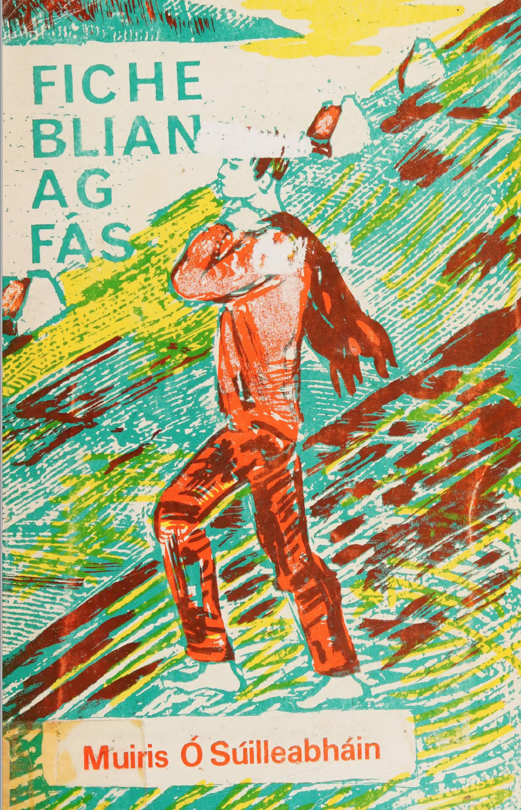
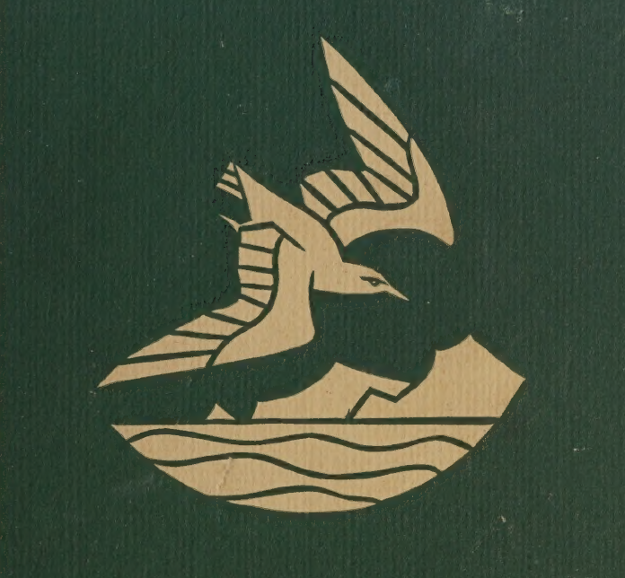

# FICHE BLIAN AG FÁS 

HTML version of the Irish Language Edition of Twenty Years a growing by Muiris Ó Súilleabháin

## Related Documents.

[English Language pdf ](https://github.com/cavedave/FicheBlian/blob/main/Twenty%20Years%20a%20Growing%20--%20Maurice%20O'Sullivan.pdf)

[Dylan Thomas Screenplay](https://github.com/cavedave/FicheBlian/blob/main/twenty%20years%20a%20growing%20--%20dylan%20thomas.pdf)

[Irish Pdf](https://github.com/cavedave/FicheBlian/blob/main/fiche%20blian%20ag%20fas%20--%20muiris%20o%20suilleabhain.pdf)

French Language Version. Vingt ans de jeunesse.  Not available yet

## Irish Table of Contents

[Réamhra an Eagarthora don dara heagran](/fiche2.html#Eagarthora)

[Réamhra an Eagarthora don triú heagran](/fiche2.html#Reamhra)

[Réamhrá an údair don chéad eagrán](/fiche2.html#eagran)

[I. I nDaingean Uí Chúise](/fiche2.html#nDaingean)

[II. Mo thuras abhaile dhom](/fiche2.html#abhaile)

[III. An baile](/fiche2.html#baile)

[IV. Lá seilge](/fiche2.html#seilge)

[V. Maicréil ag ráthaíocht](/fiche2.html#Maic)

[VI. Scairt Phiarais agus an Leaca Dhubhach](/fiche2.html#Scairt)

[VII. Oíche Shamhna](/fiche2.html#Shamhna)

[VIII. Mo chéad turas go dtí an Inis](/fiche2.html#Inis)

[IX. Ráiseanna Fionntrá](/fiche2.html#Fionn)

[X. An Tórramh](/fiche2.html#Torramh)

[XI. Oíche san Inis](/fiche2.html#sanInis)

[XII. An fear siúil](/fiche2.html#Anfear)

[XIII. An cogadh](/fiche2.html#cogadh)

[XIV. Long ar Charraig an Léochair](/fiche2.html#Charraig)

[XV. Biaiste gliomach](/fiche2.html#gliomach)

[XVI. An cleamhnas](/fiche2.html#cleamhnas)

[XVII. La bainise i mBaile an Fheirtéaraigh](/fiche2.html#bainise)

[XVIII. An tórramh Meiriceánach](/fiche2.html#Meirice)

[XIX. An stroinséir](/fiche2.html#stroin)

[XX. Mo thuras déanach go dti an Inis](/fiche2.html#thuras)

[XXI. Fágaim an baile](/fiche2.html#fagaim)

[XXII. On nDaingean soir](/fiche2.html#soir)

[XXIII. Cathair Bhaile Atha Cliath](/fiche2.html#atha)

[XXIV. Im phóilín](/fiche2.html#phoil)

[XXV. I gConamara](/fiche2.html#gConamara)

[XXVI. Críoch](/fiche2.html#crioch)

Nótaí an údair

Foclóirin

## English Table of Contents

[Introductory Note](/twenty4.html#id.gjdgxs)

English clickable chapter links not working now. 

[Translators’ Preface](/twenty4.html#id.30j0zll)

[I. In Dingle](/twenty4.html#dingle)

[II. My First Journey Home 18](/twenty4.html#first)

[III. The Island](/twenty4.html#island)

[IV. A Day’s Hunting 38](/twenty4.html#hunt)

[V. Ventry Races 46](/twenty4.html#vent)

[VI. Pierce’s Cave 76](/twenty4.html#cave)

[VII. A Shoal of Mackerel 81](/twenty4.html#shaol)

[VIII. Halloween 89](/twenty4.html#Halloween)

[IX. The Whale 97](/twenty4.html#whale)

[X. The Wake 106](/twenty4.html#wake)

[XI. A Night in the Inish 122](/twenty4.html#inish)

[XII. The War 141](/twenty4.html#war)

[XIII. The Shipwreck 155](/twenty4.html#ship)

[XIV. The Wanderer 166](/twenty4.html#wand)

[XV. The Lobster Season 186](/twenty4.html#lobster)

[XVI. Matchmaking 193](/twenty4.html#match)

[XVII The Wedding Day 204](/twenty4.html#wedding)

[XVIII. An American Wake 219](/twenty4.html#amer)

[XIX. The Stranger 224](/twenty4.html#strange)

[XX. My Last Journey to the Inish](/twenty4.html#last)

[XXI. I Leave Home](/twenty4.html#leave)

[XXII. From Dingle East](/twenty4.html#east)

[XXIII.The City of Dublin](/twenty4.html#city)

[XXIV. The Civic Guard](/twenty4.html#civic)

[XXV. Connemara](/twenty4.html#conn)

[XXVI. Conclusion](/twenty4.html#conc)

