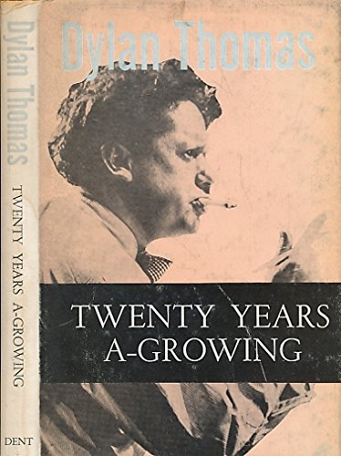

# FICHE BLIAN AG FÁS 

HTML version of the Irish Language Edition of Twenty Years a growing by Muiris Ó Súilleabháin.

## Please suggest fixes

Proofreading is ongoing in all versions. If you find errors please message me on https://mastodon.ie/@Iamreddave 
If an error happens once it probably happens elsewhere and I can fix them all at once quickly.

## Related Documents.

[English Language pdf ](https://github.com/cavedave/FicheBlian/blob/main/Twenty%20Years%20a%20Growing%20--%20Maurice%20O'Sullivan.pdf)

[Dylan Thomas Screenplay](https://github.com/cavedave/FicheBlian/blob/main/twenty%20years%20a%20growing%20--%20dylan%20thomas.pdf)

[Irish Pdf](https://github.com/cavedave/FicheBlian/blob/main/fiche%20blian%20ag%20fas%20--%20muiris%20o%20suilleabhain.pdf)

## Vingt ans de jeunesse French version 
French Language Version. Vingt ans de jeunesse.  Not scanned  yet. If you can proof read French that would be great.

[Le Banc de Maquereaux](/FicheBlian/blob/main/FrenchMackerel.txt)

## Irish Table of Contents

[Réamhra an Eagarthora don dara heagran](/fiche2.html#Eagarthora)

[Réamhra an Eagarthora don triú heagran](/fiche2.html#Reamhra)

[Réamhrá an údair don chéad eagrán](/fiche2.html#eagran)

[I. I nDaingean Uí Chúise](/fiche2.html#nDaingean)

[II. Mo thuras abhaile dhom](/fiche2.html#abhaile)

[III. An baile](/fiche2.html#baile)

[IV. Lá seilge](/fiche2.html#seilge)

[V. Maicréil ag ráthaíocht](/fiche2.html#Maic)

[VI. Scairt Phiarais agus an Leaca Dhubhach](/fiche2.html#Scairt)

[VII. Oíche Shamhna](/fiche2.html#Shamhna)

[VIII. Mo chéad turas go dtí an Inis](/fiche2.html#Inis)

[IX. Ráiseanna Fionntrá](/fiche2.html#Fionn)

[X. An Tórramh](/fiche2.html#Torramh)

[XI. Oíche san Inis](/fiche2.html#sanInis)

[XII. An fear siúil](/fiche2.html#Anfear)

[XIII. An cogadh](/fiche2.html#cogadh)

[XIV. Long ar Charraig an Léochair](/fiche2.html#Charraig)

[XV. Biaiste gliomach](/fiche2.html#gliomach)

[XVI. An cleamhnas](/fiche2.html#cleamhnas)

[XVII. La bainise i mBaile an Fheirtéaraigh](/fiche2.html#bainise)

[XVIII. An tórramh Meiriceánach](/fiche2.html#Meirice)

[XIX. An stroinséir](/fiche2.html#stroin)

[XX. Mo thuras déanach go dti an Inis](/fiche2.html#thuras)

[XXI. Fágaim an baile](/fiche2.html#fagaim)

[XXII. On nDaingean soir](/fiche2.html#soir)

[XXIII. Cathair Bhaile Atha Cliath](/fiche2.html#atha)

[XXIV. Im phóilín](/fiche2.html#phoil)

[XXV. I gConamara](/fiche2.html#gConamara)

[XXVI. Críoch](/fiche2.html#crioch)

Nótaí an údair

Foclóirin

## English Table of Contents

[Introductory Note by E. M. Forster](/FicheBlian/twenty4.html#h.v1g7ed72c5x6)

[Translators’ Preface](/FicheBlian/twenty4.html#h.56yl1huyx3ps)

[I. In Dingle](/FicheBlian/twenty4.html#h.ofjudc5wkxv)

[II, My First Journey Home](/FicheBlian/twenty4.html#h.k54y8glwe8rq)

[III. The Island](/FicheBlian/twenty4.html#h.oz5ckvx4vpn5) 

[IV. A Day’s Hunting](/FicheBlian/twenty4.html#h.7b3l2hju213p)

[V. Ventry Races](/FicheBlian/twenty4.html#h.oqi9aeoe5kmb) 

[VI. Pierce’s Cave](/FicheBlian/twenty4.html#h.fiu24d9ronar)

[VII. A Shoal of Mackerel](/FicheBlian/twenty4.html#h.v6yrpin87x84) 

[VIII. Halloween](/FicheBlian/twenty4.html#h.iq0m0er6rwaq) 

[IX. The Whale](/FicheBlian/twenty4.html#h.ec3p9rtmsivj) 

[X. The Wake](/FicheBlian/twenty4.html#h.rhs2jguzz89r) 

[XI. A Night in the Inish](/FicheBlian/twenty4.html#h.6p341mfwkgea) 

[XII. The War](/FicheBlian/twenty4.html#h.kxqrh5x55iyd) 

[XIII. The Shipwreck](/FicheBlian/twenty4.html#h.5c384yzujwe)

[XIV. The Wanderer](/FicheBlian/twenty4.html#h.lrgdcs7kk9wi) 

[XV. The Lobster Season](/FicheBlian/twenty4.html#h.l82iq5hxbtgy)

[XVI. Matchmaking](/FicheBlian/twenty4.html#h.jvmh0i36uzpa) 

[XVII The Wedding Day](/FicheBlian/twenty4.html#h.af744h843h94) 

[XVIII. An American Wake](/FicheBlian/twenty4.html#h.eljcz7q1mpwb) 

[XIX. The Stranger](/FicheBlian/twenty4.html#h.rsz6ftfycye2) 

[XX. My Last Journey to the Inish](/FicheBlian/twenty4.html#h.xm9iyikkor37)

[XXI. I Leave Home](/FicheBlian/twenty4.html#h.cygzew5tctcu) 

[XXII. From Dingle East](/FicheBlian/twenty4.html#h.6y08519q9apv)

[XXIII.The City of Dublin](/FicheBlian/twenty4.html#h.kt1z824uspc2) 

[XXIV. The Civic Guard](/FicheBlian/twenty4.html#h.557tvsnpqn4i) 

[XXV. Connemara](/FicheBlian/twenty4.html#h.gdf0sjhlzr4n)

[XXVI. Conclusion](/FicheBlian/twenty4.html#h.oo726i2w7ab5)

